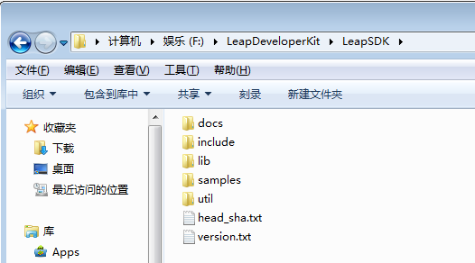
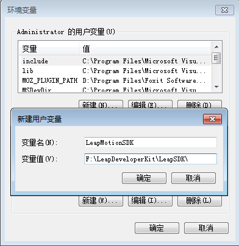
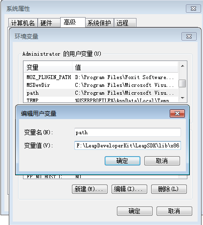
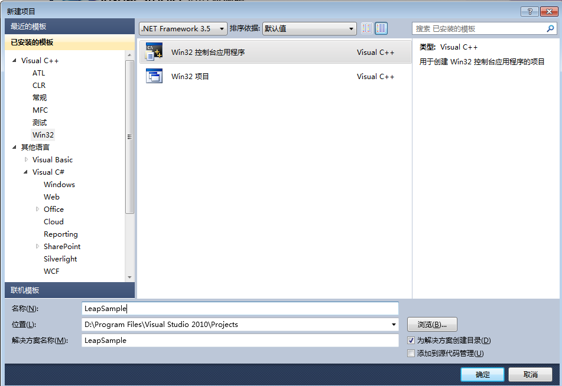
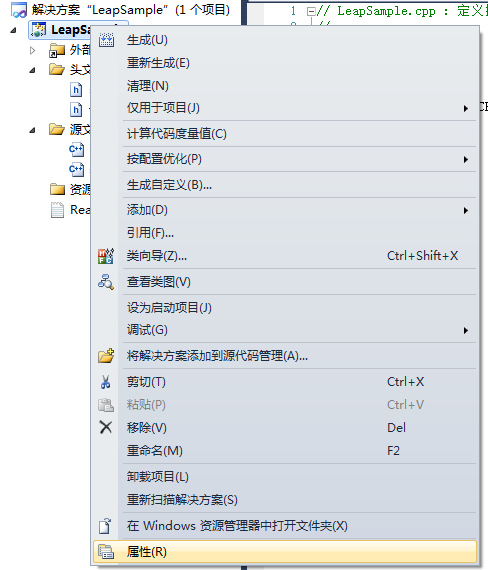
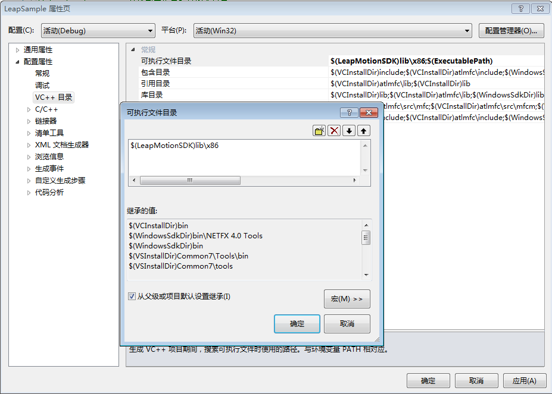
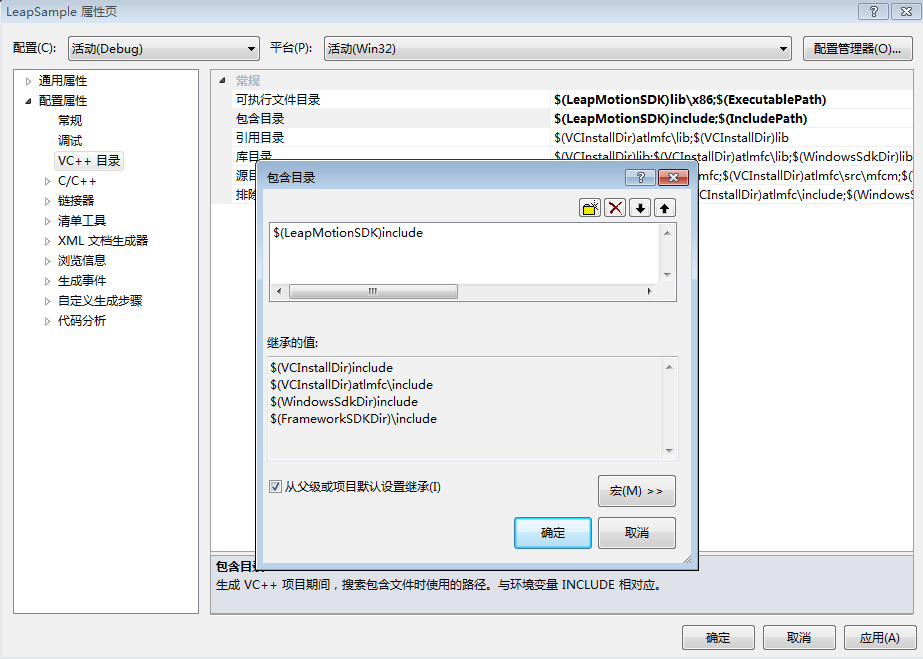
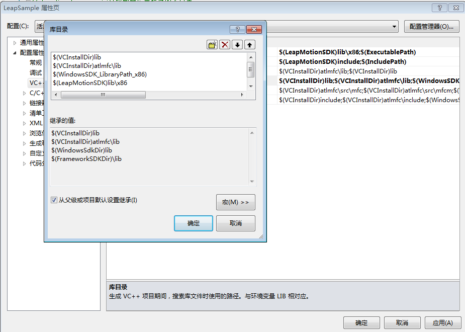
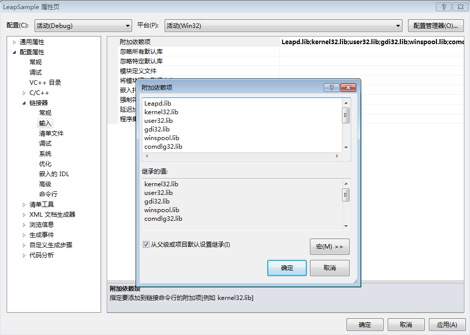
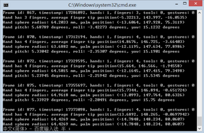

# Leap Motion Win7开发环境配置 #

先说下环境 Win7  64位  ，不过在配置的时候推荐选择32位

Leap Motion SDK 下载需要到官网去下载

下载到SDK之后，解压缩就好啦，我直接解压到了F盘，路径会后面需要




1、开始配置系统环境变量

（1）新建一个名字为LeapMotionSDK的用户变量，变量值就是SDK的地址



（2）对用户变量的Path进行修改（如果没有Path变量就同样新建一个），将SDK下的dll所在路径添加进去。

这里选择的是32位即x86的路径地址（推荐）



（3）保存，关闭所有程序，注销计算机当前用户（你也可以重启），再重新登陆。这样做为了让刚才设置的环境变量生效。

2、VS2010开启环境配置

（1）打开Visual Studio 2010或者Visual Studio 2012或者其它VS。新建一个Win32应用程序，我们起一个名字LeapSample




（2）新建的项目后，对项目属性进行修改



（3）添加可执行目录地址（可以不加，加了为保险）

$(LeapMotionSDK)lib\x86



（4）添加“包含目录”

$(LeapMotionSDK)include



(5)添加库目录


    $(VCInstallDir)lib

    $(VCInstallDir)atlmfc\lib

    $(WindowsSDK_LibraryPath_x86)

    $(LeapMotionSDK)lib\x86



(6)添加附加依赖性（链接器-->输入-->附加依赖项）

```
Leapd.lib
kernel32.lib
user32.lib
gdi32.lib
winspool.lib
comdlg32.lib
advapi32.lib
shell32.lib
ole32.lib
oleaut32.lib
uuid.lib
odbc32.lib
odbccp32.lib
```



3、至此，开发环境已经配置好

将一下代码复制到LeapSample.cpp文件中，F7编译，Ctrl+F5执行。看到如图所示输出，这表明程序配置正确（LeapMotion自然得接上）

注（代码来自：http://52coding.com/understanding-the-cpp-sample-application）




[代码文件](../code/test.cpp)