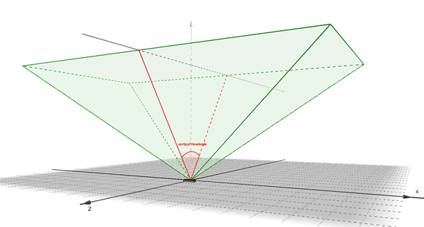

# Leap::Device Class Reference 设备类参考 #
设备类表示了一个连接的物理设备。

继承 Leap::Interface

## 公有成员函数 ##

Device ()

构造一个设备Device对象。

float      distanceToBoundary (const Vector &position) const

距离controller可视空间的边缘最近的距离。
 

float      horizontalViewAngle () const

沿着设备的x轴的视角。

bool      isValid () const

报告这个设备是否是有效的。

bool      operator!= (const Device &) const

比较设备是否不同。

bool      operator== (const Device &) const

比较设备是否相同。
 
float     range () const

最大的可靠的跟踪范围。

std::string      toString () const

一个字符串，包含对设备对象的一个简短的，可读的描述。
 
float      verticalViewAngle () const

沿着设备的z轴的视角。

## 静态公有成员函数 ##

static const  Device&  invalid()

返回一个无效的设备对象。

## 友元函数 ##

std::ostream &   operator<< (std::ostream &, const Device &)

打印包含对设备对象的一个简短的，可读的描述。

## 详细说明 ##

设备类表示了一个连接的物理设备。

Device类包含一个特定的已连接的设备的信息，例如视场，设备ID，和校准位置。

注意：Device对象可以说无效的，这就意味着它不包含有效的设备信息并且不相当于一个物理设备。使用Device::isValid()函数测试有效性。

Since

1.0

## 构造函数和析构函数文档 ##

**Leap::Device::Device()**

构造一个Device对象。

一个未初始化的设备被认为是无效的。使用Controller::devices()函数从DeviceList对象获得一个有效的设备。

```
Device device = controller.devices()[0];
```

Since

1.0

## 成员函数文档 ##

**float Leap::Device::distanceToBoundary(const Vector & position)const**

距离controller可视空间的边缘最近的距离。

可视空间是一个轴对齐的，以设备的原点为中心的倒金字塔形状，并向上延伸的有限范围。金字塔的边界通过水平视角和垂直视角和顶部的范围来描述。这个函数估计特定的输入位置和这个可视范围最近的边界或者顶部之间的距离。

```
Pointable frontFinger = controller.frame().fingers().frontmost();
float distanceToBoxWall = device.distanceToBoundary(frontFinger.tipPosition());
```

参数：

position   用来做距离计算的点位置

返回：

以毫米为单位返回输入位置和最近的边界的距离。

Since

1.0

 

 

**float Leap::Device::horizontalViewAngle()const**

沿着设备的x轴的视角。


Leap Motion 控制器扫描一个以设备的中心为中心的倒金字塔形状并向上延伸的范围。水平的视角记录了沿着设备的长边维的视角。

```
float angleOnLongDimension = device.horizontalViewAngle();
```

返回:

以弧度为单位返回水平视角。

Since

1.0

 

 

**static const Device& Leap::Device::invalid()**

返回一个无效的设备对象。

你可以使用这个函数返回的实例来比较测试一个给定的设备实例是有效的还是无效的。（你也可以使用Device::isValid()函数）

```
if (device != Device::invalid()) {
    float trackingRange = device.range();
}
```

返回：

无效的Device实例。

Since

1.0

 

 

**bool Leap::Device::isValid()const**

报告这个设备对象是否是有效的。

```
if (!device.isValid()) {
    float maxRange = device.range();
}
```

返回：

True,如果Device对象包含有效的数据。

Since

1.0

 

 

**bool Leap::Device::operator!=(const Device & )const**

比较设备对象不同。

```
thisDevice != thatDevice;
```

两个设备对象是相同的，当且仅当所以的设备对象代表的正是同一个设备并且所有的设备是有效的。

Sine

1.0

 

 

**bool Leap::Device::operator==(const Device & )const**

比较设备对象相同。

```
thisDevice == thatDevice;
```

两个设备对象是相同的，当且仅当所以的设备对象代表的正是同一个设备并且所有的设备是有效的。

Sine

1.0

 

 

**float Leap::Device::range()const**

最大的可靠的跟踪范围。

这个范围表示了从设备的中心开始对于一个可靠的被检测到的跟踪来说的最大建议距离。这个距离并不是硬极限。跟踪可能在范围之外也是可行的，或者开始有轻微的性能降低，这个距离也取决于标度和极度的环境条件。

```
float range = device.range();
```

返回：

以毫米为单位返回建议的最大范围。

Since

1.0

 

 

**std::string Leap::Device::toString()const**

一个字符串，包含对设备对象的一个简短的，可读的描述。

返回:

以字符串的形式返回设备的描述。

Since

1.0

 

 

**float Leap::Device::verticalViewAngle()const**

沿着设备的z轴的视角。



Leap Motion 控制器扫描一个以设备的中心为中心的倒金字塔形状并向上延伸的范围。垂直的视角记录了沿着设备的短边维的视角。

```
float angleOnShortDimension = device.verticalViewAngle();
```

返回:

以弧度为单位返回垂直视角。

Since

1.0

 

 

 

## 友元函数和相关函数文档 ##

**std::ostream& operator<<(std::ostream & , const Device &)**

打印包含对设备对象的一个简短的，可读的描述。

```
std::cout << device << std::endl;
```
Since

1.0